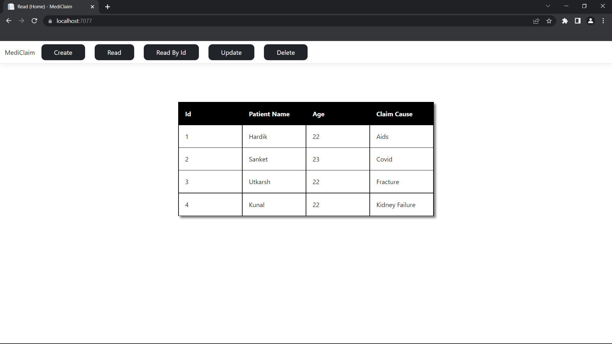
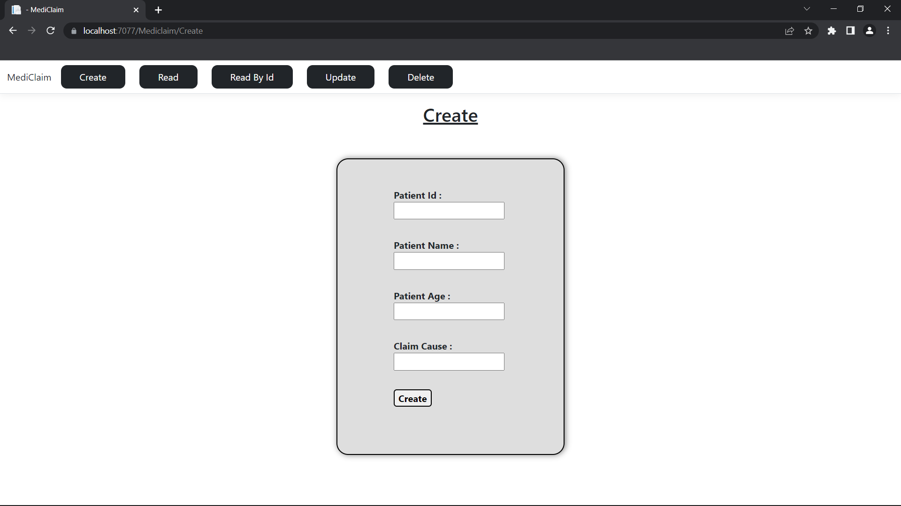
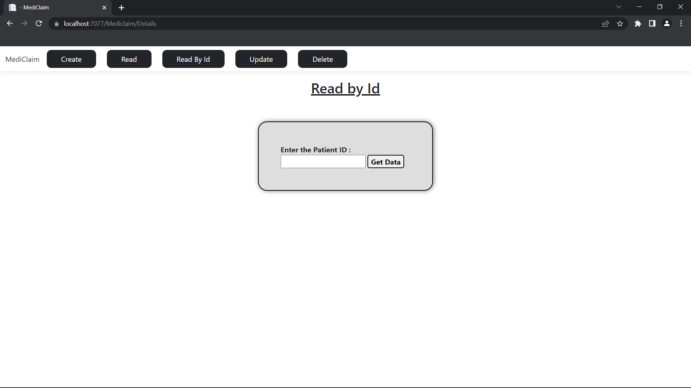

# MediClaim-CRUD

Simple Mediclaim CRUD app made in ASP.NET MVC Core and .NET Web API.

## Tech Stack

- ### Frontend : ASP.NET Core, Razor Pages
- ### Backend : .NET Core Web API 
- ### Database : MS SQL

## Steps to run project in development mode

- Create Database named as ClaimManagement and Create Table by running the CreateTable.sql file.
- Run the WebApiDemo project first by opening its solution in Visual Studio.
- Run the FrontendDemo project first by opening its solution in Visual Studio.
- Incase if dependencies are not installed properly or database is not getting connected then follow [these steps](https://gist.github.com/Gstar1525/7729a3ddf943ad18f280599213c0ee17).

## API routes

- Create Claim (POST) - ``` /api/mediclaims ```
- Read All Claims (GET) - ``` /api/mediclaims ```
- Read Claim by Id (GET) - ``` /api/mediclaims/{id} ```
- Update Claim (PUT) - ``` /api/mediclaims/{id} ```
- Delete Claim (DELETE) - ``` /api/mediclaims/{id} ```

## Client routes

- Create - ``` /mediclaim/create ```
- Read - ``` / ```
- Read By Id - ``` /mediclaim/details ```
- Update - ``` /mediclaim/edit ```
- Delete - ``` /mediclaim/delete ```

## Screenshots

- ### Home Page - Read


<br/>

- ### Create Page


<br/>

- ### Read/Delete/Update By Id


<br/>

- ### Update Page

